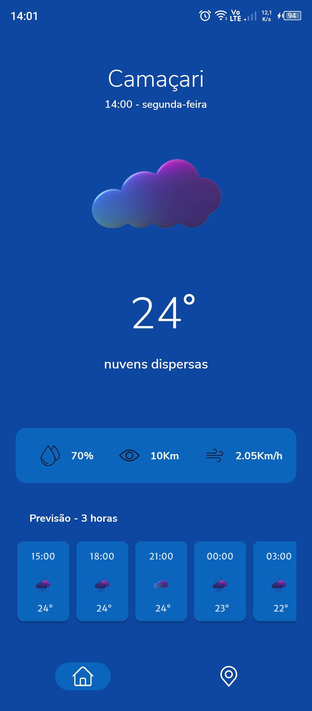

<h1 align="center"></h1>

<p align="center">
  <a href="https://opensource.org/licenses/Apache-2.0"></a>
  <a href="https://android-arsenal.com/api?level=26"></a>
  <br>
  <a href="https://wa.me/+5571991154541"></a>
  <a href="https://www.linkedin.com/in/emerson-dos-santos-silva-398319206/"></a>
  <a href="mailto:emersonsantos1921@gmail.com"></a>
</p>

<p align="center">  

⭐ Esse é um projeto para demonstrar meu conhecimento técnico no desenvolvimento Android nativo com Kotlin. Mais informações técnicas abaixo.

Aplicativo que faz uma requisição REST que recebe dados de previsão do tempo e exibe pro úsuario, e possui uma segunda tela de favoritos navegavel por um bottomNavigation guardadas em um BD local em ROOM para o úsuario guardar suas cidades favoritas.

</p>

</br>

<p float="left" align="center">




</p>

## Download
Faça o download da <a href="apk/tempus.apk?raw=true">APK diretamente</a>. Você pode ver <a href="https://www.google.com/search?q=como+instalar+um+apk+no+android">aqui</a> como instalar uma APK no seu aparelho android.

## Tecnologias usadas e bibliotecas de código aberto

- Minimum SDK level 26
- [Linguagem Kotlin](https://kotlinlang.org/)

- Jetpack - LISTE O MÁXIMO DE COMPONENTES DO JETPACK QUE VOCÊ USA
  - Custom Views: View customizadas feitas do zero usando XML.
  - ViewBinding: Liga os componentes do XML no Kotlin através de uma classe que garante segurança de tipo e outras vantagens.
  - RecyclerView: View customizada para exibição de listas dinâmicas.
  - Fragment: Parte reutilizável da UI que gerencia o próprio layout de visualização.
  - Navigation: Permite interações que possibilitam os usuários navegar, entrar e sair de diferentes partes do conteúdo no aplicativo.
  - Splash Screen: Tela de carregamento exibida ao abrir um aplicativo Android para melhorar a experiência do usuário.
  - Lifecycle: Observe os ciclos de vida do Android e manipule os estados da interface do usuário após as alterações do ciclo de vida.
  - Coroutines: São uma forma de programação assíncrona que facilita a escrita de código concorrente e paralelo de maneira simples e fácil de ler.
  - ViewModel: Gerencia o detentor de dados relacionados à interface do usuário e o ciclo de vida. Permite que os dados sobrevivam a alterações de configuração, como rotações de tela.
  - Room: Biblioteca de abstração do banco de dados SQLite que garante segurança em tempo de compilação e facilidade de uso.
  
  - [...]

- Arquitetura -
  - MVVM (View - ViewModel - Model)
  - Comunicação da ViewModel com a View através de Kotlin State Flow e LiveData.
  - Comunicação da ViewModel com a Model atráves de retornos lambda e KOtlin State Flow.
  - Repositories para abstração da comunidação com a camada de dados.
  - Data Source para abstração das requisições REST.
  
- Bibliotecas -
  - [Places](https://developers.google.com/maps/documentation/places/android-sdk?hl=pt-br): Para os serviços de localização do Google.
  - [Koin](https://insert-koin.io/docs/quickstart/android/): Para injeção de dependência.
  - [ThreeTenABP](https://github.com/JakeWharton/ThreeTenABP): biblioteca Java que oferece classes de data e hora para Android, incluindo suporte ao UTC e ao fuso horário.
  - [Glide](https://github.com/bumptech/glide): Para carregamento de imagens e cacheamento das mesmas.
  - [Retrofit2 & OkHttp3](https://github.com/square/retrofit): Para realizar requisições seguindo o padrão HTTP.
  - [Jackson](https://github.com/FasterXML/jackson): Para desserialização das requisições JSON.

  - [...]

## Arquitetura
**Tempus** utiliza a arquitetura MVVM,o padrão de Repositories e Singletons, Coroutines, Fluxos eColeta de estado que segue as [recomendações oficiais do Google](https://developer.android.com/topic/architecture/recommendations?hl=pt-br).
</br></br>

<br>

## API de terceiros

 -Tempus usa:-<br>
  - [OpenWeatherAPI](https://openweathermap.org/api) para suas chamadas REST.<br>
  - [AppIntro](https://github.com/AppIntro/AppIntro) do usuário do Github[AppIntroTeam](https://github.com/AppIntro): Para criar uma introdução em carrosel para o aplicativo.<br>

## Features

### Feature 1


Tela de introdução, salvando a primeira cidade mais a tela principal do App.

### Feature 2


Tela de favoritos, mostrando as funcionalidades da aba.

# Licença

COLOQUE A LICENÇA - https://opensource.org/licenses

```xml
   Copyright [2023] [Emerson Dos Santos Silva]

   Licensed under the Apache License, Version 2.0 (the "License");
   you may not use this file except in compliance with the License.
   You may obtain a copy of the License at

   http://www.apache.org/licenses/LICENSE-2.0

   Unless required by applicable law or agreed to in writing, software
   distributed under the License is distributed on an "AS IS" BASIS,
   WITHOUT WARRANTIES OR CONDITIONS OF ANY KIND, either express or implied.
   See the License for the specific language governing permissions and
   limitations under the License.
```


